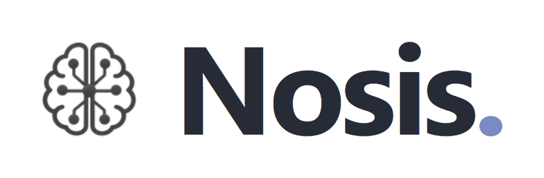

<div align="center">
  
  <br><br>
  <b>English</b> &middot; <a href="README.zh-CN.md">简体中文</a>
</div>

Nosis is an open-source, lightweight personal agent application. It provides local workspace operations, human approval, session persistence, context management, long-term memory, plans, subagents, scheduled tasks, and Skill / Plugin / MCP extensibility — with both a TUI and a GUI.

```text
TUI ────────────┐
                ├── Bridge ── agent_runtime ── agent_core
GUI ── FastAPI ─┘
```

- `agent_core` provides frontend-agnostic agent mechanisms.
- `agent_runtime` reads application configuration and assembles the Core into a runnable instance.
- Bridge runs as a standalone process and is the only channel through which a frontend drives the Runtime.
- The TUI and GUI hosts share execution state and interaction semantics through the Bridge protocol; the Bridge subprocess channel uses newline-delimited JSON.

## Key capabilities

- **Controlled local execution**: A session supports three permission presets — `Ask for approval`, `Workspace Access`, and `Full Access`. Shell enters the workspace sandbox or the host environment according to scope, while file tools are always confined to the current workspace.
- **Desktop automation**: The main agent can observe and operate the visible desktop through `computer_screenshot` and `computer_action`, covering screenshots, clicks, drags, scrolling, key presses, and text input. Both tools are on by default and visible only to the main agent, and each call is confirmed according to the current permission preset.
- **A complete agent loop**: streaming responses, tool batches, context compaction, steer, cancel, plans, and background jobs.
- **Resumable sessions**: conversation and execution events are written to an append-only JSONL journal, and the TUI and GUI can read the same kind of session.
- **Memory and scheduled tasks**: global and workspace-scoped long-term memory, plus one-shot, interval, and cron tasks.
- **Models and media**: models are reached through LiteLLM, and providers can be routed independently for the main agent, vision, image generation, and each subagent role.
- **Extension system**: standalone skills, skills / agents / MCP components provided by plugins, and standalone MCP servers.
- **Two frontends**: the TUI suits terminal workflows; the GUI offers multi-session management, attachments, a file tree, settings, memory, and scheduled tasks.

## Quick start

Requirements: Python >= 3.11, Node.js >= 22, and [uv](https://docs.astral.sh/uv/).

```bash
git clone https://github.com/EvannZhongg/Nosis.git
cd Nosis
npm install
npm run build
uv tool install --editable ".[gui]"
```

If you create the project environment with `uv sync`, install the GUI extra as well, otherwise Uvicorn cannot serve the session WebSocket:

```bash
uv sync --extra gui
```

Start the TUI once in the current directory:

```bash
nosis
```

The first launch initializes `~/.nosis/`. After quitting the TUI, create `~/.nosis/.env` and fill in the environment variables required by the default provider, for example:

```dotenv
OPENAI_KEY=your-api-key
```

Then restart the TUI:

```bash
nosis
```

Or start the GUI:

```bash
nosis-gui
```

The GUI listens on <http://127.0.0.1:8737> by default.

## Module documentation

| Document | Scope |
| --- | --- |
| [`agent_core`](agent_core/README.md) | Agent loop, context, session, tools, execution, permissions, memory, plans, jobs, scheduler, providers, skills, and MCP mechanisms |
| [`agent_runtime`](agent_runtime/README.md) | Configuration, prompts, plugin discovery, runtime assembly, execution plane, session binding, and turn entry |
| [`interfaces/bridge`](interfaces/bridge/README.md) | The standalone Bridge process, protocol routing, event translation, and frontend interaction forwarding |
| [`interfaces/protocol`](interfaces/protocol/README.md) | The TypeScript protocol types and connection-state conventions shared by the TUI and GUI |
| [`interfaces/tui`](interfaces/tui/README.md) | The Ink terminal interface, commands, input state, and Bridge subprocess attachment |
| [`interfaces/gui`](interfaces/gui/README.md) | The FastAPI service, React interface, multi-session connections, HTTP / WebSocket API, and media access |

## Configuration and data

`agent_runtime` creates the configuration directory on first launch and is responsible for reading and updating the application configuration inside it:

| Path | Contents |
| --- | --- |
| `~/.nosis/provider_config.json` | Providers, models, and role routing |
| `~/.nosis/agent_config.json` | Tools, context, memory, skill paths, subagents, MCP, workspace instructions, and scratch workspace settings |
| `~/.nosis/.env` | The secrets and environment variables referenced by the configuration |
| `~/.nosis/prompts/` | Main agent, subagent, compaction, and memory prompts |
| `~/.nosis/skills/` | Standalone skills |
| `~/.nosis/plugins/` | Plugin capability packages |
| `~/.nosis/AGENTS.md` | User-level global workspace instruction |
| `~/.nosis/MEMORY.md` | Global long-term memory |
| `~/.nosis/sessions/` | Session journals, workspace memory, artifacts, and subagent records |
| `~/.nosis/schedule.jsonl` | Scheduled tasks and run records |
| `<workspace>/.nosis/attachments/` | Uploaded attachments and agent-generated images |

The default configuration and built-in resources live in [`agent_runtime/defaults/`](agent_runtime/defaults). See [`agent_runtime/README.md`](agent_runtime/README.md) for how assembly works.

## Development and testing

Python tests use a mock provider and need no real API key:

```bash
python -m venv .venv
source .venv/bin/activate
python -m pip install -e ".[gui]"
python -m unittest discover -s tests -v
```

The GUI extra includes FastAPI, Uvicorn, the WebSocket backend, and multipart support; Windows, macOS, and Linux use the same installation.

Frontend build, type checking, and tests:

```bash
npm run build
npm run typecheck
npm test
```

The Linux sandbox integration tests require a working bubblewrap and user namespaces; when the runtime conditions are not met, the tests explicitly skip.

On Windows the shell tool uses PowerShell 7, so PowerShell 7 has to be installed separately.

## Contributors

- [AKArrok](https://github.com/AKArrok): reported and verified the append-only journal tail-append issue ([#2](https://github.com/EvannZhongg/Nosis/pull/2)).
- [George Pickett](https://github.com/georgeatparallel): contributed the Parallel Search MCP integration ([#4](https://github.com/EvannZhongg/Nosis/pull/4)).
- [Pocket99](https://github.com/Pocket99): contributed the initial GUI, with sessions, workspace browsing, and model switching ([#1](https://github.com/EvannZhongg/Nosis/pull/1)).

## License

[MIT](LICENSE)
